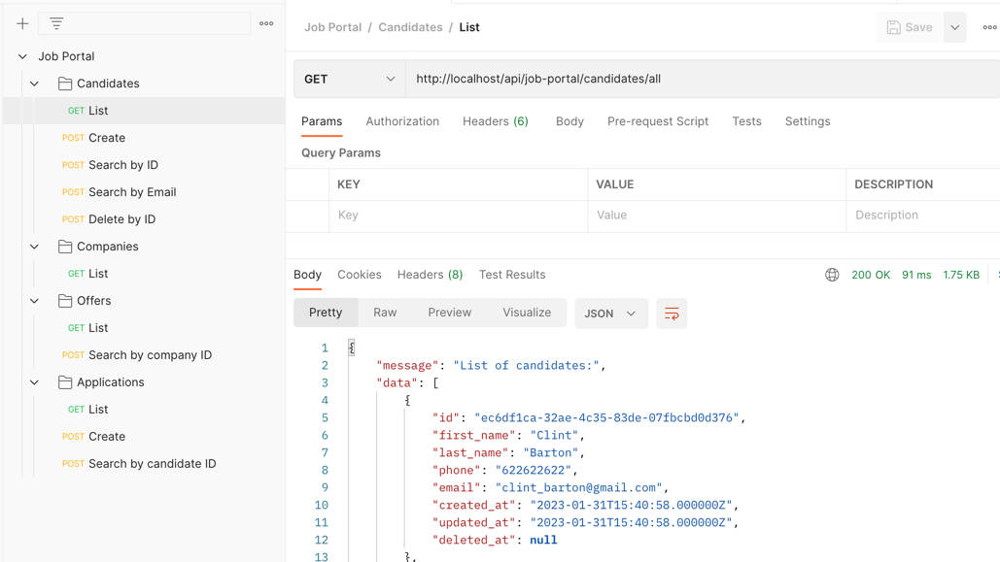

### Project information
Project made with Laravel 9.

The purpose of this project is simply to make a small demo of DDD simulating what would be a job portal with companies, offers, candidates and applications.

## User's manual
Once the project is cloned, we must follow these steps:
- Copy the .env.example with the name `.env`.
- Run composer install.
- Install Laravel Sail (if needed `php artisan sail:install`).
- Start Laravel Sail `./vendor/bin/sail up -d`.
- Run php artisan migrate `./vendor/bin/sail php artisan migrate` to create tables.
- Run php artisan db:seed `./vendor/bin/sail php artisan db:seed` to fill tables with fake info.
- By running the following URL `http://localhost/api/job-portal/candidates/all` you should be able to see a list of candidates.

### You will find more endpoints in the postman attached to this project.
`resources/postman/Job Portal.postman_collection.json`

